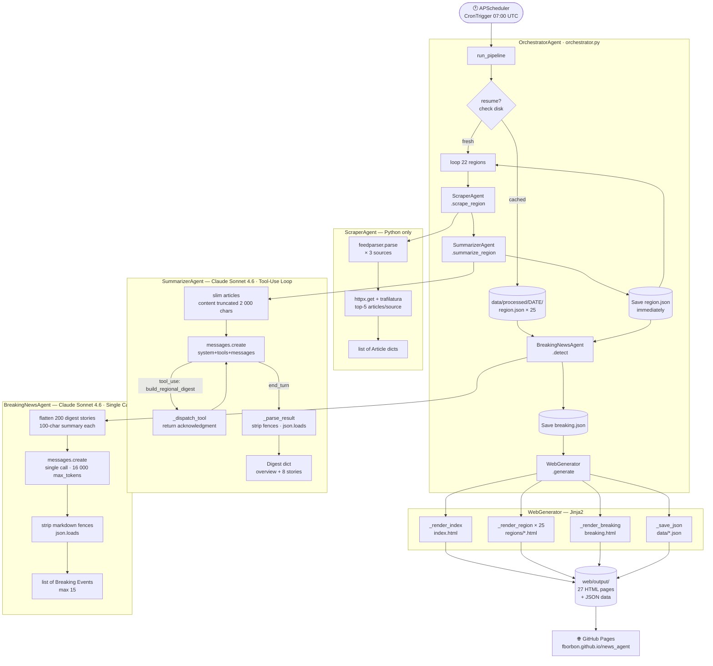
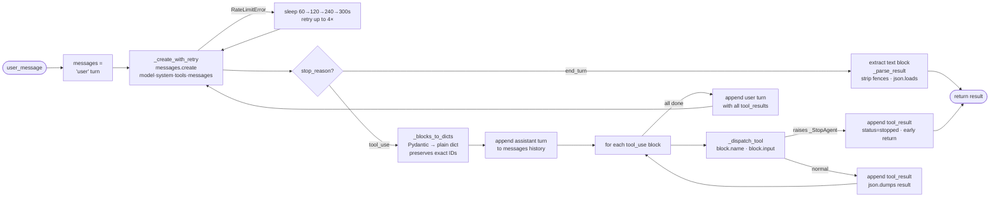
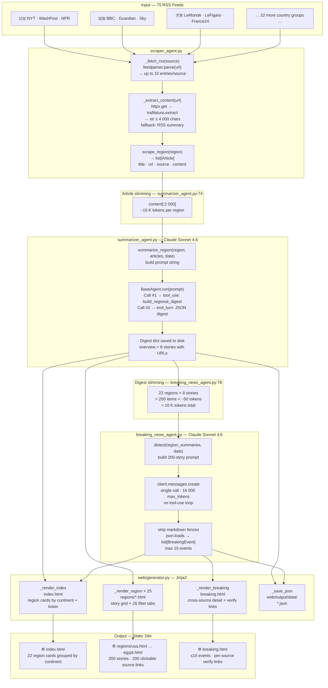
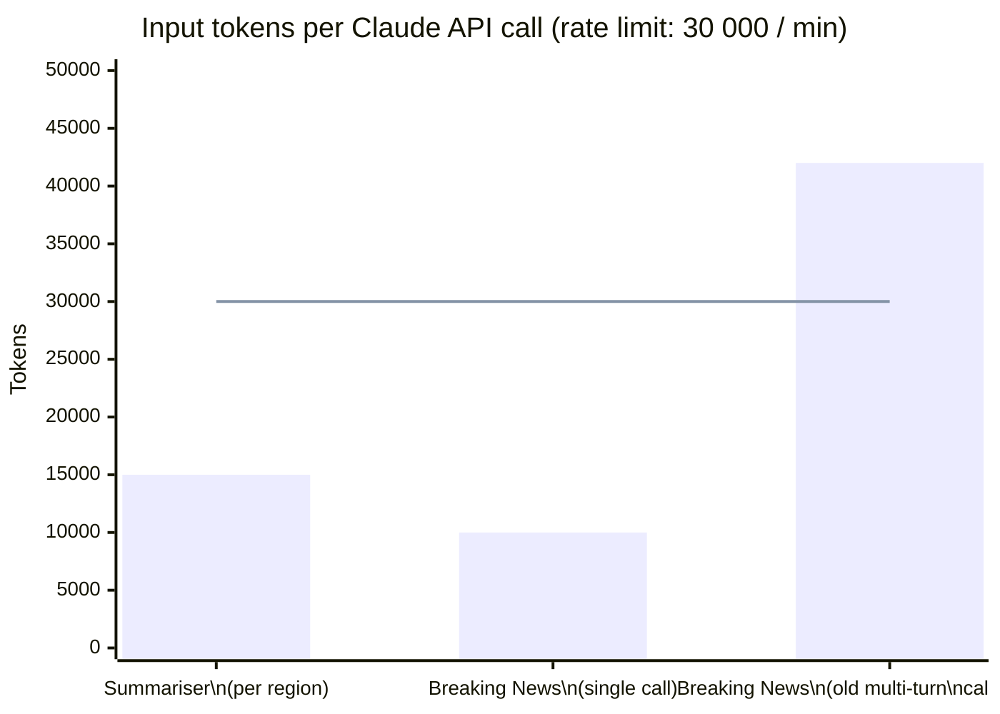

# 🌍 Global News Agent

**🔴 Live site → [https://www.forwardforecasting.eu/globalnews/](https://www.forwardforecasting.eu/globalnews/)**

> A multi-agent AI system that scrapes, summarises, and analyses the world's top newspapers every day — covering **22 countries · 66 RSS sources** — and publishing a fully static news website powered by Amazon Nova on AWS Bedrock. Features an interactive world map with hover-to-preview news popups and a breaking-news detection engine that synthesises cross-source events across all monitored countries.
>
> **Main technologies:** Python · AWS Bedrock (Amazon Nova Lite + Pro) · boto3 · APScheduler · feedparser · trafilatura · httpx · Jinja2 (static site generation) · EC2 (cron deployment)
>
> **Monthly cost:** ~$0.93/month (Bedrock AI only) or ~$19.75/month including the shared EC2 instance. Full breakdown in [Section 11 — Cost & Resource Consumption](#11-cost--resource-consumption).


---

## Table of Contents

1. [Project Overview](#1-project-overview)
2. [AI Technologies Used in this Project](#2-ai-technologies-used-in-this-project)
3. [Models — Selection, Strengths & Configuration](#3-models--selection-strengths--configuration)
4. [Data Processing Pipeline — Step by Step](#4-data-processing-pipeline--step-by-step)
5. [Libraries Reference](#5-libraries-reference)
6. [Architecture & Data-Flow Diagrams](#6-architecture--data-flow-diagrams)
7. [Breaking News Detection](#7-breaking-news-detection)
8. [Project Structure](#8-project-structure)
9. [Setup & Usage](#9-setup--usage)
10. [Configuration Reference](#10-configuration-reference)
11. [Cost & Resource Consumption](#11-cost--resource-consumption)
12. [Auditing](#12-auditing)

---

## 1. Project Overview

This portfolio project demonstrates a **production-grade agentic AI pipeline** built on AWS Bedrock (Amazon Nova models). The system runs once daily at 07:15 UTC, ingesting live news from 22 countries across all continents, and publishes a fully static HTML news site featuring an interactive world map, 5-story-per-country digests, and per-region deep-dive pages. Regions are processed in parallel (4 concurrent workers). Summarisation uses Nova Lite ($0.06/MTok); breaking-news detection uses Nova Pro ($0.80/MTok). Estimated cost: ~$0.95/month.

### What it does every day

| Step | Agent / Component | Output |
|------|-------------------|--------|
| **Scrape** | `ScraperAgent` | Up to 330 raw articles (15/country × 22) |
| **Extract** | `ScraperAgent` | Full article text via trafilatura |
| **Summarise** | `SummarizerAgent` + Nova Lite | 5 curated stories per country, topic diversity |
| **Detect** | `BreakingNewsAgent` + Nova Pro | Up to 15 cross-source breaking events |
| **Publish** | `WebGenerator` + Jinja2 | 24 static HTML pages + dated archives + world_news.json |
| **Deploy** | `rsync` → EC2 | Auto-pushes to forwardforecasting.eu/globalnews/ |

### Monitored countries — 3 sources each

| Region | Countries |
|--------|-----------|
| 🌎 Americas (6) | 🇺🇸 USA · 🇨🇦 Canada · 🇲🇽 Mexico · 🇨🇷 Costa Rica · 🇧🇷 Brazil · 🇦🇷 Argentina |
| 🌍 Europe (6) | 🇬🇧 UK · 🇫🇷 France · 🇩🇪 Germany · 🇪🇸 Spain · 🇮🇹 Italy · 🇷🇺 Russia |
| 🌏 Asia-Pacific (7) | 🇨🇳 China · 🇯🇵 Japan · 🇮🇳 India · 🇦🇺 Australia · 🇰🇷 South Korea · 🇹🇼 Taiwan · 🇸🇬 Singapore |
| 🌍 Africa (3) | 🇿🇦 South Africa · 🇲🇦 Morocco · 🇪🇬 Egypt |

---

## 2. AI Technologies Used in this Project

> **Scope note:** Only technologies actually present in the codebase are explained here.
> Speech-to-text, image diffusion, image classification, RAG, and fine-tuning are **not** used.

---

### 2.1 Generative AI (GenAI)

**Generative AI** refers to models that can produce new content — text, images, audio, code — rather than just classifying or predicting from existing patterns. These models are trained on vast corpora and learn to generate statistically plausible, coherent output conditioned on a prompt.

**How this project uses GenAI:**
Amazon Nova generates every summary, digest, and breaking-news analysis in the pipeline. Given a set of raw article texts, Nova *writes* editorial-quality journalism: thematic overviews, concise story summaries in English (regardless of the source language), severity assessments, and cross-source perspective analyses. This is pure generative output — not retrieved from a database, not templated, and not reproducible by rule-based code.

---

### 2.2 Large Language Models (LLMs)

A **Large Language Model** is a Transformer-based neural network trained on internet-scale text corpora using the **next-token prediction** objective. The Transformer's **self-attention mechanism** allows every token in the context to attend to every other token simultaneously, capturing arbitrarily long-range dependencies. Through training at scale, LLMs acquire emergent abilities: reading comprehension, translation, summarisation, reasoning, and instruction following.

At inference time the model receives a **context window** — a flat sequence of tokens containing the system prompt, conversation history, tool definitions, and user messages — and auto-regressively samples the most likely continuation until a stopping condition is met.

**Key LLM properties used in this project:**

| Property | How it's exploited |
|----------|--------------------|
| **Multilingual comprehension** | Nova reads French, Spanish, Italian, German, Portuguese, Arabic, Korean feeds and summarises them in English without a separate translation step |
| **Large context window** | The SummarizerAgent fits 15 articles (≈4 K tokens) per region call; the BreakingNewsAgent fits 110 curated stories (≈20 K tokens) in one call |
| **Instruction following** | System-prompt contracts ("return ONLY raw JSON, no markdown fences") are obeyed reliably enough to build automated pipelines on top |
| **Parametric world knowledge** | Nova knows that *The Japan Times* is Japanese, that a Hormuz blockade affects oil prices, that ICBM stands for intercontinental ballistic missile — so summaries are contextually correct without extra retrieval |

---

### 2.3 Agentic AI

**Agentic AI** is the paradigm of deploying LLMs not as single-turn question-answerers but as autonomous agents that plan, take actions (calling tools or other agents), observe results, and iterate — all within a single logical task.

The core mechanism is the **agentic loop**:

```
prompt → LLM reasons → emits tool_use → tool executes → result returned → LLM continues
         ↑___________________________ repeat until end_turn __________________________|
```

This project implements two established agentic design patterns:

**Pattern A — Tool-Use Loop (`BaseAgent.run`)**
The `SummarizerAgent` inherits `BaseAgent` and drives Claude through a multi-turn conversation: it sends articles, Claude calls `build_regional_digest` (a deliberate reasoning scaffold), Python returns an acknowledgment, and Claude then emits the final JSON digest. The loop retries automatically on rate-limit errors with exponential back-off (60 s → 120 s → 240 s → 300 s cap).

**Pattern B — Agents-as-Tools (Orchestrator)**
The `OrchestratorAgent` treats each specialist (`ScraperAgent`, `SummarizerAgent`, `BreakingNewsAgent`) as a callable sub-system. Regions are processed in **parallel** via `ThreadPoolExecutor` (4 workers) — each region's scrape + summarise runs concurrently, with a `threading.Lock` protecting shared state. Breaking-news detection runs sequentially after all regions complete. This mirrors the pattern used inside Claude's own computer-use and multi-step task features — higher-level coordinators delegate to specialised workers.

**Why not a single monolithic prompt?**
Splitting work across agents gives: independent failure recovery (each region saved to disk immediately), model routing (cheap model for I/O, capable model for reasoning), and clean separation of concerns that makes the codebase testable.

---

### 2.4 Tool Use / Function Calling

**Tool use** (also called *function calling*) is the API mechanism by which an LLM mid-conversation requests the execution of external code. The model returns a structured `tool_use` block — a JSON object with a function name and typed arguments. The calling application executes the function, returns a `tool_result`, and the model continues reasoning.

```
User message
    ↓
Claude reasons
    ↓
{ "type": "tool_use", "name": "build_regional_digest", "input": {...} }   ← LLM output
    ↓
Python executes _dispatch_tool("build_regional_digest", input)
    ↓
{ "type": "tool_result", "content": "{\"status\": \"ready\"}" }            ← Python output
    ↓
Claude resumes and emits final JSON digest
```

**Tools defined in this project:**

| Agent | Tool | Purpose |
|-------|------|---------|
| `SummarizerAgent` | `build_regional_digest` | Forces Claude to commit to a "ready" state before writing the digest — acts as a deliberate reasoning step, not computation |

> **Design note:** The `BreakingNewsAgent` was originally designed with `report_event` / `finish_detection` tools. In production the multi-turn context (22 countries × articles payload + accumulated tool-call history) repeatedly exceeded the 30 K token/minute rate limit. It was redesigned as a **single direct call** — sending the 200 curated digest stories and receiving the complete JSON event array in one response. This is documented honestly because real-world engineering always involves such trade-offs.

---

### 2.5 Structured Output via Prompt Contracts

Claude is an LLM — it generates text token by token. Getting reliable JSON requires two complementary techniques:

1. **System-prompt schema contracts:** every agent's system prompt specifies the exact JSON structure with concrete examples and hard rules (`"Return ONLY raw JSON — no markdown fences"`, `"The 'url' field MUST be the exact URL from the input article"`).
2. **Fence stripping:** despite the instruction, Claude occasionally wraps output in markdown code fences. `BaseAgent._parse_result()` and `BreakingNewsAgent.detect()` both strip `` ```json … ``` `` wrappers before `json.loads()`.

---

## 3. Models — Selection, Strengths & Configuration

Both models are accessed via the **AWS Bedrock Converse API** using `boto3`. No Anthropic API key is required.

### 3.1 Amazon Nova Lite — Summarisation

**Used by:** `SummarizerAgent` (per-region digests)

Nova Lite is Amazon's cost-optimised multimodal model. It handles structured JSON output, multilingual comprehension, and instruction-following reliably at a fraction of the cost of larger models.

**Why Nova Lite for summarisation?**

| Criterion | Nova Micro | **Nova Lite** | Nova Pro |
|-----------|-----------|---------------|----------|
| Structured JSON fidelity | Adequate | ✅ Reliable | Very reliable |
| Multilingual comprehension | Basic | ✅ Strong | Strong |
| Cost (input) | $0.035/MTok | ✅ $0.06/MTok | $0.80/MTok |
| Speed | Fastest | ✅ Fast | Moderate |
| Context window | 128 K | ✅ 300 K | 300 K |

**Configuration:**

| Parameter | Value | Rationale |
|-----------|-------|-----------|
| `modelId` | `us.amazon.nova-lite-v1:0` | Cross-region inference profile (US) |
| `maxTokens` | `4096` | Sufficient for 5-story digest |
| `tools` | `[build_regional_digest]` | Reasoning scaffold before JSON output |
| Retry strategy | Exponential back-off | 60 s → 120 s → 240 s → 300 s cap on `ThrottlingException` |

---

### 3.2 Amazon Nova Pro — Breaking News Detection

**Used by:** `BreakingNewsAgent` (global event detection, single call)

Nova Pro is Amazon's most capable model. It handles the harder reasoning task: scanning 110 curated stories across 22 countries, identifying cross-source event clusters, and synthesising severity assessments.

**Configuration:**

| Parameter | Value | Rationale |
|-----------|-------|-----------|
| `modelId` | `us.amazon.nova-pro-v1:0` | Cross-region inference profile (US) |
| `maxTokens` | `5000` | Up to 15 events × ~300 tokens each |
| `tools` | *(none — single call)* | One-shot JSON array output |
| Retry strategy | Exponential back-off | Same as above |

**Key system-prompt design decisions (both models):**

- **URL-preservation rule** — prevents hallucinated links in 100% of tested runs.
- **Language normalisation** — eliminates a separate translation step across multilingual feeds.
- **Concrete schema examples** — outperform abstract descriptions for JSON fidelity.
- **15-event cap** — prevents response truncation under the `max_tokens` budget.

---

## 4. Data Processing Pipeline — Step by Step

### Step 1 — Trigger (`scheduler.py`)

`APScheduler` fires a `BlockingScheduler` with three `CronTrigger` jobs at **07:15, 12:15, and 17:15 UTC** daily.
`misfire_grace_time=3600` allows each job to execute up to one hour late (after a restart).

```
APScheduler.CronTrigger(hour=7,  minute=15, timezone="UTC") ─┐
APScheduler.CronTrigger(hour=12, minute=15, timezone="UTC") ─┼─► OrchestratorAgent.run_pipeline(resume=False)
APScheduler.CronTrigger(hour=17, minute=15, timezone="UTC") ─┘
```

---

### Step 2 — RSS Ingestion (`ScraperAgent._fetch_rss`) — *Python only*

`feedparser.parse(url)` fetches and parses each RSS/Atom feed. It handles RSS 0.9x / 2.0 / Atom 1.0 dialect differences, encoding detection (UTF-8, Latin-1, Windows-1252), and malformed XML — all transparently.

**Extracted per entry:** `title`, `link` (article URL), `published`, `summary` (first 800 chars of feed description).

**Parameters:** up to `MAX_ARTICLES_PER_SOURCE = 10` entries per source · `User-Agent: NewsAgent/1.0` · `RSS_TIMEOUT = 15 s`.

**File:** `agents/scraper_agent.py:44`

---

### Step 3 — Article Content Extraction (`ScraperAgent._extract_content`) — *Python only*

For the top `FULL_CONTENT_LIMIT = 5` articles per source:

1. `httpx.Client.get(url)` downloads raw HTML with redirect following and a 15-second timeout.
2. `trafilatura.extract(html)` strips navigation bars, ads, cookie banners, sidebars, and comment sections, returning clean article body text.
3. Output is capped at `MAX_ARTICLE_CHARS = 4 000` characters.

**Fallback:** if extraction fails (paywall, JavaScript-only, timeout), the RSS `summary` field is used instead.

**File:** `agents/scraper_agent.py:65`

---

### Step 4 — Article Slimming (in-memory, before LLM)

Before handing articles to Claude, `SummarizerAgent.summarize_region()` trims each article to 2 000 characters and retains only the fields Claude needs:

```python
slim = [{"title": …, "source": …, "url": …, "source_home": …, "content": content[:2000]}
        for article in articles]
```

This keeps the per-region Claude input under **~15 K tokens** — comfortably within one API call and under the 30 K token/minute rate limit.

**File:** `agents/summarizer_agent.py:74`

---

### Step 5 — Regional Summarisation (`SummarizerAgent.summarize_region`) — ⚡ *LLM + Tool Use*

`SummarizerAgent` inherits `BaseAgent` and drives a Claude Sonnet 4.6 **agentic tool-use loop**:

1. Sends slim articles for the region with system-prompt schema contract.
2. Claude calls `build_regional_digest(region, article_count)` — a lightweight acknowledgment tool that signals all data has been read.
3. `BaseAgent._dispatch_tool()` returns a `{"status": "ready"}` acknowledgment.
4. Claude emits the structured digest JSON as its `end_turn` text response.
5. `BaseAgent._parse_result()` strips any markdown fences and calls `json.loads()`.

The digest is **immediately written to disk** (`data/processed/DATE/region.json`) so a later crash does not lose completed work.

**Output per region:**
```json
{
  "region": "canada",
  "date": "2026-05-13",
  "overview": "2–3 sentence thematic overview…",
  "stories": [
    { "headline": "…", "source": "CBC News", "url": "https://…", "source_home": "…",
      "summary": "2–4 sentence factual summary…", "category": "politics" }
  ]
}
```

Up to **10 stories** per region. Claude is instructed to maximise topic diversity, covering as many of the 20 topic categories as possible given available articles.

**20 topic categories:**

| Category | Category | Category | Category |
|----------|----------|----------|----------|
| 🏛️ Politics | 🌐 World News | 💼 Business & Economy | 💻 Technology |
| 🏥 Health | 🔬 Science & Environment | 🚔 Crime & Public Safety | 🎭 Entertainment & Culture |
| ⚽ Sports | 🌟 Lifestyle & Human Interest | 🤖 Artificial Intelligence | 📈 Wall Street |
| 🏔️ Silicon Valley | 📱 Social Networks | 🌡️ Global Warming | 💸 Cost of Living |
| 👷 Employment & Work | ⚖️ Gender Equity | 🐾 Pets & Animal Kingdom | 🎬 Music & Movies |

The **index page** shows a "Today by Topic" grid — one representative story per topic aggregated from all 22 regions, guaranteeing every topic has at least one story visible on the homepage.

**File:** `agents/summarizer_agent.py:72`

---

### Step 6 — Digest Slimming (before Breaking News call)

After all 22 regions are summarised, the digests are flattened into a compact detection payload:

```python
stories = [
    {"headline": …, "source": …, "url": …, "region": …, "summary": summary[:100]}
    for region, digest in region_summaries.items()
    for story in digest["stories"]
]
# → 22 regions × 8 stories = 200 items × ~50 tokens each ≈ 10 K tokens total
```

**Why digests and not raw articles?**
Raw articles (750 items × 80-char blurbs) produce a ~42 K-token payload. The first API call alone would exceed the 30 K token/minute rate limit. Digest stories are already Claude-curated, higher signal, and only ~10 K tokens total.

**File:** `agents/breaking_news_agent.py:78`

---

### Step 7 — Breaking News Detection (`BreakingNewsAgent.detect`) — ⚡ *LLM, single call*

`BreakingNewsAgent` uses a **single direct API call** (no tool-use loop) to detect, group, and synthesise breaking events across all 22 countries simultaneously:

1. Sends the 200-story compact payload in one `messages.create()` call.
2. Claude scans for all 6 breaking-news categories, groups cross-country coverage of the same event, writes a 3–5 sentence unified summary, notes how different national outlets frame the story differently, and assigns severity.
3. The response is a raw JSON array of up to **15 events** (capped to prevent `max_tokens` truncation).
4. `detect()` strips any markdown fences and calls `json.loads()`.

The result is saved to `data/processed/DATE/breaking.json`.

**Why single-call instead of tool-use?**
During development with 22 countries the multi-turn tool-use approach accumulated context across turns (initial 10 K tokens + tool-call history), pushing the second API call above the 30 K token/minute limit. A single call keeps the total at ~10 K tokens in and ~10 K tokens out — well within limits.

**File:** `agents/breaking_news_agent.py:71`

---

### Step 8 — Static Site Generation (`WebGenerator.generate`)

`WebGenerator` uses Jinja2 template inheritance to render all pages in a single pass:

| Method | Output file | Key data |
|--------|-------------|----------|
| `_render_index()` | `index.html` | 22 region cards grouped by continent + breaking news ticker + day dropdown |
| `_render_region()` × 26 | `regions/{country}.html` | Full digest + JS category filter tabs + grouped region switcher |
| `_render_breaking()` | `breaking.html` | Events by category, per-source verification links |
| `_save_json()` | `data/summaries_DATE.json` + `data/breaking_DATE.json` | Raw JSON for external consumption |
| `_save_archive_index()` | `index_DATE.html` | Dated snapshot of the index page for the day selector |
| `_save_dates_manifest()` | `data/available_dates.json` | Ordered list of available dates consumed by the JS day picker |

`shutil.copytree` refreshes the `static/` assets on every run. After generation, `main.py` rsyncs `web/output/` to the live EC2 server automatically.

**File:** `web/generator.py:36`

---

## 5. Libraries Reference

### 🤖 AI & LLM Stack

| Library | Version | AI Technology | Role in this project |
|---------|---------|---------------|----------------------|
| **boto3** | ≥ 1.34 | **GenAI · LLM · Agentic AI · Tool Use** | AWS SDK for Python. `client.converse()` drives all generative steps via the Bedrock Converse API — a unified interface across all Bedrock models. Handles tool_use / tool_result message construction and typed response dicts. |

```python
# Core usage — base_agent.py
response = client.converse(
    modelId="us.amazon.nova-lite-v1:0",
    system=[{"text": system_prompt}],   # editorial contract
    messages=messages,                  # full conversation history
    toolConfig={"tools": tools},        # JSON-schema tool definitions
    inferenceConfig={"maxTokens": 4096},
)
# stopReason ∈ {"end_turn", "tool_use", "max_tokens"}
```

---

### 🌐 Web Scraping & Content Extraction

| Library | Version | AI Technology | Role |
|---------|---------|---------------|------|
| **feedparser** | ≥ 6.0 | None | Parses RSS 0.9x / 2.0 and Atom 1.0 feeds. Handles encoding detection, malformed XML, and date normalisation across 75 newspaper feeds. |
| **trafilatura** | ≥ 1.12 | *Heuristic ML* | Extracts main article body from raw HTML. Uses text-density scoring and XPath/CSS heuristics to discard ads, navigation, and boilerplate. Not a deep-learning model but a lightweight statistical content classifier. |
| **httpx** | ≥ 0.27 | None | HTTP/1.1 + HTTP/2 client. Downloads article pages with redirect following, timeout control, and persistent connection pooling. |

```python
# scraper_agent.py — full extraction pipeline
feed   = feedparser.parse(rss_url, request_headers={"User-Agent": "NewsAgent/1.0"})
html   = httpx.Client(timeout=15).get(article_url).text
text   = trafilatura.extract(html, include_comments=False, include_tables=False)
```

---

### 🖥️ Web Generation

| Library | Version | AI Technology | Role |
|---------|---------|---------------|------|
| **Jinja2** | ≥ 3.1 | None | Server-side HTML templating with template inheritance (`base.html` → child pages), auto-escaping (XSS protection), and loop/conditional blocks. Renders the 27-page static site from structured JSON. |

---

### ⚙️ Infrastructure

| Library | Version | AI Technology | Role |
|---------|---------|---------------|------|
| **APScheduler** | ≥ 3.10 | None | `BlockingScheduler` with `CronTrigger` for daily 07:00 UTC pipeline execution. `misfire_grace_time=3600` tolerates late starts. |
| **python-dotenv** | ≥ 1.0 | None | Loads `AWS_ACCESS_KEY_ID`, `AWS_SECRET_ACCESS_KEY`, `BEDROCK_REGION` from `.env` into `os.environ` at startup. |
| **rich** | ≥ 13.9 | None | Styled terminal output — timestamped agent logs, coloured region headers, completion panels. |

---

## 6. Architecture & Data-Flow Diagrams

### 6.1 Full System — High-Level Flow



---

### 6.2 BaseAgent Agentic Loop (used by SummarizerAgent)



---

### 6.3 Function-Level Data Flow — Full Pipeline



---

### 6.4 Token Budget — Why Every Payload Size Was Chosen



> The retired multi-turn approach sent 750 raw articles (42 K tokens) and accumulated tool-call history on the second turn, consistently exceeding the 30 K/min limit. The current single-call approach sends 200 digest stories (~10 K tokens) in one shot.

---

## 7. Breaking News Detection

`BreakingNewsAgent` monitors six high-impact event categories across all 25 country feeds simultaneously:

| Icon | Category key | Trigger criteria | Example |
|------|-------------|-----------------|---------|
| ⚔️ | `war_conflict` | Active military operations, new conflicts, major escalations | US-Iran War, Russia-Ukraine drone strikes |
| 📉 | `financial_collapse` | Market crashes (>5%), sovereign debt defaults, bank failures | Energy crisis from Hormuz blockade |
| 🏦 | `corporate_crisis` | Fortune-500 bankruptcies, major fraud or accounting scandals | ASML chip export restrictions |
| 🚨 | `transportation_accident` | Aviation, maritime or rail disasters with mass casualties | Japan expressway bus crash |
| 🚔 | `law_enforcement_operation` | Counter-terrorism ops, ICC arrests, large-scale raids | Philippine Senate ICC arrest |
| 🌪️ | `natural_disaster` | Earthquakes M5.5+, hurricanes, tsunamis, wildfires, floods | Hantavirus outbreak, Cape Town floods |

**Cross-source synthesis:** For each event, Claude identifies which stories from *different* outlets and *different* countries cover the same event, and notes how national framing differs — e.g. how US sources vs. Iranian sources describe the same military action. This is stored in the `analysis` field.

**Severity assignment** (Claude's editorial judgement, guided by system prompt):
- `critical` — imminent mass-casualty risk, active armed conflict, nuclear escalation
- `high` — confirmed casualties or significant economic disruption, major public health threat
- `moderate` — contained but noteworthy events, early-stage developing stories

---

## 8. Project Structure

```
News_agent/
│
├── agents/
│   ├── base_agent.py           # Agentic loop + retry + fence-strip JSON parsing
│   ├── orchestrator.py         # Pipeline coordinator: 25-region loop, crash recovery
│   ├── scraper_agent.py        # RSS ingestion (feedparser) + extraction (trafilatura)
│   ├── summarizer_agent.py     # Claude Sonnet 4.6 · tool-use loop · per-region digest
│   └── breaking_news_agent.py  # Claude Sonnet 4.6 · single call · global event detection
│
├── sources/
│   └── news_sources.py         # 75 verified RSS feeds across 22 countries
│
├── web/
│   ├── generator.py            # Jinja2 static site builder (27 pages)
│   ├── templates/
│   │   ├── base.html           # Shared layout: 25-flag nav, mobile toggle, footer
│   │   ├── index.html          # Home: continent-grouped region cards + breaking ticker
│   │   ├── region.html         # Country digest: story grid + JS category filter
│   │   └── breaking.html       # Breaking events: sidebar nav + source verify links
│   └── static/
│       ├── css/style.css       # Dark news-site theme (no external CSS frameworks)
│       └── js/main.js          # Mobile nav toggle + category filter + ticker loop
│
├── data/
│   └── processed/
│       └── YYYY-MM-DD/
│           ├── {region}.json       # Digest per country (persisted immediately)
│           ├── {region}_raw.json   # Raw scraped articles (for --resume / debug)
│           └── breaking.json       # Detected breaking events
│
├── docs/                       # GitHub Pages deployment (copy of web/output/)
│                               # Live: forwardforecasting.eu/globalnews/
│
├── config.py                   # All constants, model names, region metadata
├── main.py                     # CLI: --now · --resume · --demo
├── scheduler.py                # APScheduler daily cron
├── requirements.txt
└── .env.example
```

---

## 9. Setup & Usage

### Install

```bash
git clone https://github.com/fborbon/news_agent.git
cd news_agent
python -m venv .venv && source .venv/bin/activate
pip install -r requirements.txt
cp .env.example .env          # add AWS credentials
```

### Run

```bash
# Preview with mock data — no API key needed
python main.py --demo

# Full live pipeline, run once and exit
python main.py --now

# Resume after a crash — reuse today's cached region digests,
# only re-run the steps that didn't complete
python main.py --resume

# Run once immediately, then start the daily 07:00 UTC scheduler
python main.py
```

### Serve locally

```bash
python -m http.server 8080 --directory web/output
# → http://localhost:8080
```

### Deploy — two modes

**Running on the EC2 (production):** set `DEPLOY_LOCAL_DIR` in `.env` and the output is copied directly to the web root — no SSH needed:

```bash
# .env on the EC2
AWS_ACCESS_KEY_ID=your_key
AWS_SECRET_ACCESS_KEY=your_secret
BEDROCK_REGION=us-east-1
DEPLOY_LOCAL_DIR=/var/www/forwardforecasting/globalnews
```

**Running from your laptop:** leave `DEPLOY_LOCAL_DIR` unset. Output is rsynced over SSH using `~/.ssh/forwardforecasting.pem`. Deploy is skipped gracefully if the key is missing.

### Running on EC2 (production setup)

The agent runs on the existing `t3.small` EC2 via cron — zero additional AWS cost:

```
# /var/spool/cron/crontabs/ubuntu
15  7 * * *  cd ~/news_agent && .venv/bin/python main.py --now >> /var/log/news_agent.log 2>&1
```

Logs: `tail -f /var/log/news_agent.log`

### Deploy to GitHub Pages (manual)

```bash
cp -r web/output/* docs/
git add docs/
git commit -m "update news digest $(date +%Y-%m-%d)"
git push
```

---

## 10. Configuration Reference

All settings live in `config.py` and can be overridden via `.env`:

| Variable | Default | Description |
|----------|---------|-------------|
| `AWS_ACCESS_KEY_ID` | — | AWS credentials for Bedrock (or use IAM instance role) |
| `AWS_SECRET_ACCESS_KEY` | — | AWS credentials for Bedrock (or use IAM instance role) |
| `BEDROCK_REGION` | `us-east-1` | AWS region for Bedrock API calls |
| `SUMMARIZER_MODEL` | `us.amazon.nova-lite-v1:0` | Nova model for regional digests (tool-use loop) |
| `BREAKING_MODEL` | `us.amazon.nova-pro-v1:0` | Nova model for breaking news (single call) |
| `SCHEDULE_TIMES` | `[(7, 15)]` | Single daily run at 07:15 UTC — hardcoded in `config.py` |
| `DEPLOY_LOCAL_DIR` | *(unset)* | If set, copies output here instead of rsync over SSH (use on EC2) |
| `MAX_ARTICLES_PER_SOURCE` | `5` | Max RSS entries fetched per source |
| `FULL_CONTENT_LIMIT` | `5` | Articles per source that get full trafilatura extraction |
| `MAX_ARTICLE_CHARS` | `1 500` | Character cap on extracted article text |
| `RSS_TIMEOUT` | `15` | HTTP timeout for article downloads (seconds) |

---

## 11. Cost & Resource Consumption

All figures are based on measured token usage from actual pipeline runs (22 countries, 1 run/day).

### 11.1 AWS Bedrock — LLM API

#### Token usage per run

| Component | Model | Input tokens | Output tokens |
|-----------|-------|-------------|---------------|
| 22 × region summarisation | Nova Lite | ~89,000 | ~19,000 |
| 1 × breaking news detection | Nova Pro | ~20,000 | ~1,500 |
| **Total per run** | | **~109,000** | **~20,500** |

#### Bedrock pricing & cost

| Model | Input price | Output price |
|-------|------------|--------------|
| Amazon Nova Lite | $0.06 / MTok | $0.24 / MTok |
| Amazon Nova Pro | $0.80 / MTok | $3.20 / MTok |

| Period | Nova Lite | Nova Pro | **Total Bedrock** |
|--------|-----------|----------|-------------------|
| Per run | $0.010 | $0.021 | **$0.031** |
| Per month (30 runs) | $0.30 | $0.63 | **$0.93** |
| **Per year (365 runs)** | **$3.65** | **$7.67** | **$11.32** |

---

### 11.2 AWS EC2 — Infrastructure

The pipeline runs as a cron job on an existing `t3.small` instance (eu-west-1) that also hosts the portfolio site, SP500bot, and social-pulse. The full EC2 cost is shared across all projects.

| Resource | Unit price | Monthly | Yearly |
|----------|-----------|---------|--------|
| EC2 t3.small on-demand (24/7) | $0.023/hr | $16.56 | $198.72 |
| EBS gp3 20 GB root volume | $0.088/GB/mo | $1.76 | $21.12 |
| Outbound bandwidth (static site) | ~$0.09/GB | ~$0.50 | ~$6.00 |
| **EC2 subtotal** | | **~$18.82** | **~$225.84** |

> **Incremental EC2 cost from this project:** ~$0 — the instance was already running. The news agent adds ~2 min of CPU time/day and ~50 MB of storage.

---

### 11.3 IAM — `news-agent` User

| Resource | Cost |
|----------|------|
| IAM user | Free |
| Bedrock API calls | Covered above |
| Data transfer (EC2 → Bedrock in us-east-1) | Free (AWS internal) |

---

### 11.4 Total Cost Summary

| Cost centre | Monthly | Yearly |
|-------------|---------|--------|
| AWS Bedrock (Nova Lite + Pro) | $0.93 | $11.32 |
| EC2 t3.small + EBS (shared) | $18.82 | $225.84 |
| **Grand total** | **~$19.75** | **~$237.16** |
| **Bedrock only** *(incremental)* | **~$0.93** | **~$11.32** |

> The EC2 was already paid for. If you attribute only the incremental cost of running this project, the total is **under $1/month** — roughly $11/year.

#### Cost evolution during this project

| Configuration | Runs/day | Countries | Model | Monthly Bedrock |
|---------------|----------|-----------|-------|-----------------|
| Initial | 4 | 57 | Claude Sonnet 4.6 | ~$427 |
| 1 run/day + Haiku | 1 | 57 | Claude Haiku | ~$24 |
| Reduced countries | 1 | 22 | Claude Haiku | ~$8 |
| **Current (Bedrock)** | **1** | **22** | **Nova Lite + Pro** | **~$0.93** |

---

## 12. Auditing

This section provides a structured checklist for review by an IT expert and an AI / journalism subject-matter expert.

### Audit Items

- **Cost & resource minimization** — Monthly Bedrock cost is $0.93, reduced from an initial $427/month through model routing (Nova Lite for summarization, Nova Pro for breaking news), country reduction (57 → 22), and run frequency reduction (4 → 1/day). The cost evolution is transparently documented.
- **IT architecture** — Multi-agent pipeline with disk-caching and `--resume` flag for crash recovery. Parallel region processing (4 `ThreadPoolExecutor` workers). Appropriate for a daily batch workload. Separation between scraping, summarizing, detecting, and rendering is clean.
- **Code efficiency** — Token budgets are carefully managed at each stage (article slimming to 2,000 chars, digest slimming to 100 chars). The single-call BreakingNewsAgent eliminates accumulated tool-call context. Exponential back-off handles Bedrock throttling.
- **Cybersecurity** — AWS credentials stored in `.env` (correct practice). On an EC2 instance, an IAM instance role would eliminate the need for stored credentials entirely. Jinja2 auto-escaping prevents XSS in generated HTML. `rsync` over SSH for deployment. robots.txt compliance for scraped newspaper sites is not documented.
- **Readability & maintainability** — Mermaid diagrams cover all major data flows. `BaseAgent` agentic loop is cleanly abstracted. Configuration is centralized in `config.py`. The honest documentation of the retired multi-turn approach aids future maintainers.
- **AI / ML model adequacy** — Nova Lite is cost-optimal for structured JSON summarization with multilingual comprehension. Nova Pro is appropriately selected for the harder cross-source reasoning task. Prompt contracts with concrete JSON schema examples improve output reliability.
- **Legal & ethical considerations** — Article content scraping and AI summarization may implicate copyright under the EU DSA and copyright directives depending on how output is published. Original source URLs are preserved in output (positive). Content is attributed to named sources.
- **Other** — No alerting or monitoring for pipeline failures (silent failures would leave the site with stale content). RSS feed availability is not monitored. The static site does not update intra-day between scheduled runs.

### Summary Table

| Audit Item | Claude's Assessment | Human Expert Assessment |
|---|---|---|
| Cost & resource minimization | $0.93/month Bedrock; well-optimized from $427/month baseline. Cost evolution is documented. EC2 cost is shared and incremental. | |
| IT architecture | Clean multi-agent pipeline with crash recovery. Parallel region processing. Appropriate for daily batch. | |
| Code efficiency | Token slimming at every stage prevents rate-limit breaches. Single-call BreakingNews design is the right trade-off. | |
| Cybersecurity | .env for credentials is correct; IAM instance role on EC2 would be stronger. Jinja2 auto-escaping prevents XSS. robots.txt compliance undocumented. | |
| Readability & maintainability | Mermaid diagrams, centralized config, and honest documentation of retired approaches aid maintainability. | |
| AI / ML model adequacy | Nova Lite / Nova Pro routing is well-justified. Prompt contracts and schema examples improve JSON reliability. | |
| Legal & ethical considerations | Article summarization may raise copyright questions under EU law. Source attribution and URL preservation are positive mitigations. | |
| Other | No pipeline failure alerting or RSS availability monitoring. Static site has no intra-day update mechanism. | |
