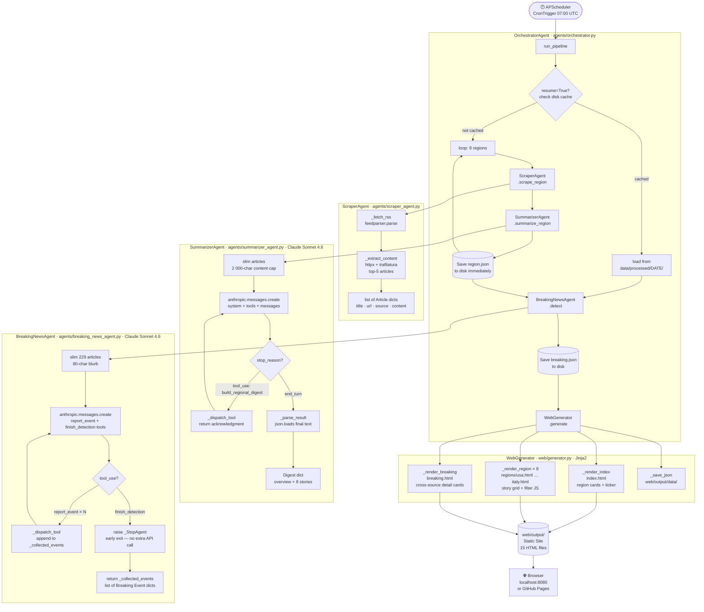
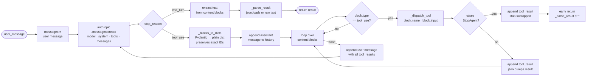
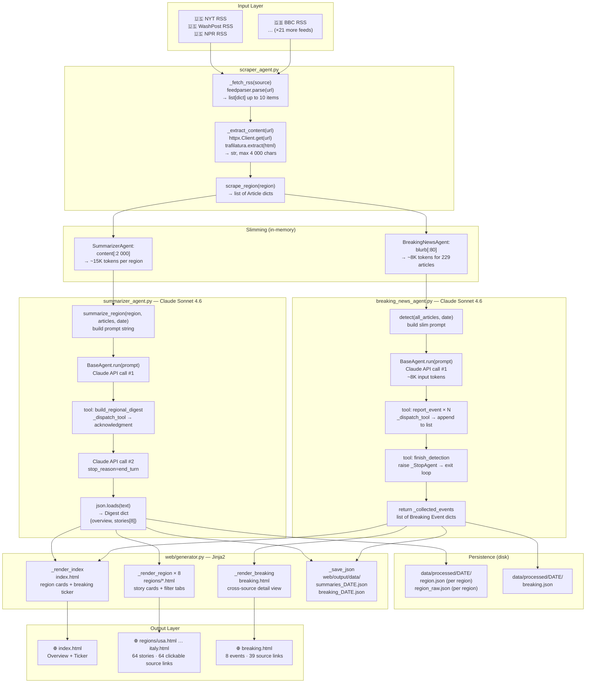
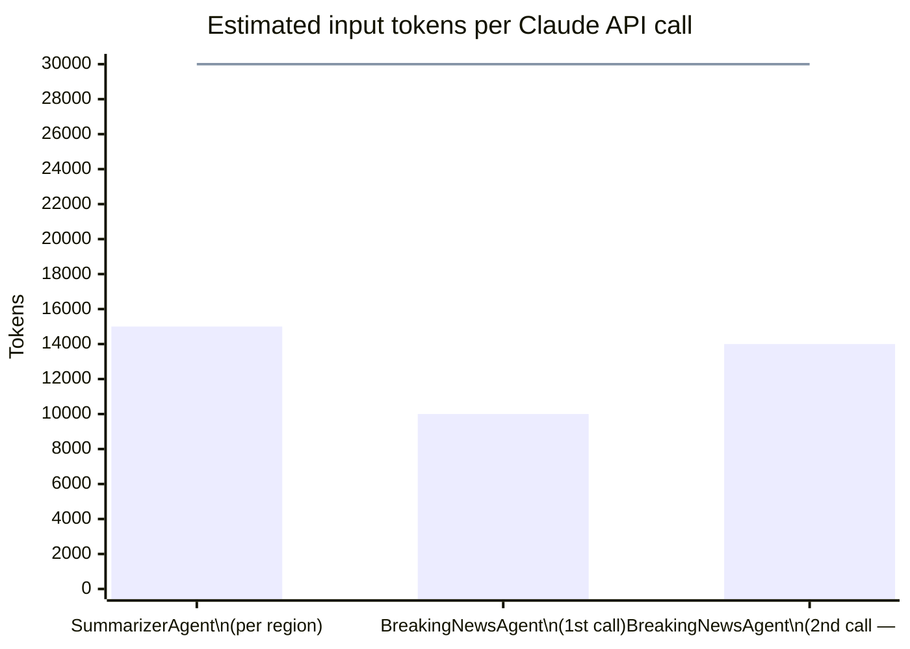

# 🌍 Global News Intelligence Agent

> A multi-agent AI system that scrapes, analyses, and summarises the world's top newspapers every day — detecting breaking events across 8 countries and generating a fully static news website, powered by Claude.


---

## Table of Contents

1. [Project Overview](#1-project-overview)
2. [AI Technologies Used](#2-ai-technologies-used)
3. [Models: Selection, Strengths & Configuration](#3-models-selection-strengths--configuration)
4. [Data Processing Pipeline — Step by Step](#4-data-processing-pipeline--step-by-step)
5. [Libraries Reference](#5-libraries-reference)
6. [Architecture & Data-Flow Diagrams](#6-architecture--data-flow-diagrams)
7. [Breaking News Detection](#7-breaking-news-detection)
8. [Project Structure](#8-project-structure)
9. [Setup & Usage](#9-setup--usage)
10. [Configuration Reference](#10-configuration-reference)

---

## 1. Project Overview

This project demonstrates a production-grade **multi-agent AI pipeline** built on Anthropic's Claude API. Instead of a single monolithic prompt, the workload is split across specialised agents that communicate via **tool use** (function calling): an Orchestrator delegates tasks to a Scraper, a Summariser, and a Breaking News Detector — each backed by its own Claude model instance, system prompt, and toolset.

Every day the system:

| Step | What happens |
|------|-------------|
| **Scrape** | Fetches RSS feeds from 24 newspapers across 8 countries |
| **Extract** | Pulls full article text from the top articles per source |
| **Summarise** | Claude produces a structured digest per region |
| **Detect** | Claude scans the full article pool for high-impact breaking events |
| **Synthesise** | Claude merges multiple-source coverage of the same event |
| **Publish** | Jinja2 renders a complete static HTML site with source links |

### Monitored sources (3 per country)

| Region | Newspapers |
|--------|-----------|
| 🇺🇸 USA | The New York Times · The Washington Post · NPR News |
| 🇬🇧 UK | BBC News · The Guardian · Sky News |
| 🇫🇷 France | Le Monde · Le Figaro · France 24 |
| 🇩🇪 Germany | Deutsche Welle · Der Spiegel International · Die Zeit |
| 🇪🇸 Spain | El País (EN) · El Mundo · La Vanguardia |
| 🇯🇵 Japan | The Japan Times · NHK World · Asahi Shimbun |
| 🇨🇳 China | South China Morning Post · China Daily · Global Times |
| 🇮🇹 Italy | ANSA · La Repubblica · Corriere della Sera |

---

## 2. AI Technologies Used

### 2.1 Large Language Models (LLMs)

A **Large Language Model** is a neural network trained on vast text corpora to predict the next token in a sequence. Through this objective — applied at enormous scale — the model acquires the ability to read, reason, and write like a skilled human. Modern LLMs use the **Transformer architecture** (Vaswani et al., 2017), whose **self-attention mechanism** allows every token to attend to every other token in the context, capturing long-range dependencies that earlier recurrent networks struggled with.

At inference time, the model receives a **context window** (a sequence of tokens representing the conversation, instructions, tools, and history) and produces a probability distribution over the vocabulary at each step, sampling the most likely next token until a stopping condition is met.

**How this project uses LLMs:**

| Agent | Task | Why an LLM and not rules? |
|-------|------|--------------------------|
| `SummarizerAgent` | Read 15–30 raw articles and write a structured digest | Requires reading comprehension, cross-article deduplication, multi-language understanding, and editorial judgement — infeasible with heuristics |
| `BreakingNewsAgent` | Scan 229 article headlines across 8 countries, classify by event type, synthesise cross-source perspectives | Requires semantic understanding of geopolitical context and the ability to group related stories across different languages and framings |

### 2.2 Tool Use / Function Calling

**Tool use** (also called *function calling*) is the mechanism by which an LLM can request the execution of external code mid-conversation. Instead of free-form text, the model returns a structured `tool_use` block containing a function name and typed JSON arguments. The calling application executes the function, returns a `tool_result`, and the model continues — potentially calling more tools — until it reaches `end_turn`.

This enables **agentic behaviour**: the model drives a multi-step process, using tools to perceive the world, take actions, and update its reasoning based on results.

```
User message
    ↓
Claude reasons about task
    ↓
Claude emits tool_use { name, input }   ← structured JSON call
    ↓
Python executes the tool
    ↓
tool_result returned to Claude          ← structured JSON result
    ↓
Claude continues reasoning
    ↓
... (loop until stop_reason == "end_turn")
    ↓
Claude emits final text response
```

**Tools defined in this project:**

| Agent | Tool | What it enables |
|-------|------|----------------|
| `SummarizerAgent` | `build_regional_digest` | Signals Claude that all articles are loaded; forces a deliberate reasoning step before outputting JSON |
| `BreakingNewsAgent` | `report_event` | Claude calls this once per breaking event, depositing structured metadata (title, category, summary, sources, severity) into a Python list without needing a free-form JSON block |
| `BreakingNewsAgent` | `finish_detection` | Claude signals completion; triggers `_StopAgent` to exit the loop without an extra API round-trip |

### 2.3 Structured Output via System Prompts

LLMs do not natively output valid JSON — they generate text token by token. To get reliable structured data, this project uses two complementary techniques:

1. **Strict system-prompt contracts**: every agent's system prompt specifies the exact JSON schema and includes rules like *"Return ONLY valid JSON — no markdown fences, no commentary"* and *"The `url` field MUST be the exact URL from the input article"*.
2. **Tool-call accumulation**: the `BreakingNewsAgent` never relies on a final JSON blob — it accumulates events incrementally via `report_event` tool calls, each of which has a typed schema enforced by the Anthropic API.

### 2.4 Agentic Patterns

This project implements two established agentic design patterns:

**Pattern 1 — Tool-Use Loop (`BaseAgent.run`)**
The core loop in `base_agent.py` implements the standard agentic cycle: send prompt → receive response → if tool calls present, execute and return results → repeat until `end_turn`. Each agent subclass is an independent reasoning unit with its own loop.

**Pattern 2 — Agents as Tools (Orchestrator)**
The `OrchestratorAgent` treats `ScraperAgent`, `SummarizerAgent`, and `BreakingNewsAgent` as callable sub-systems. This is the same pattern used by Claude's own computer-use and multi-step task features — higher-level planners delegate to specialised workers.

> **Note — what this project does NOT use:**
> RAG (Retrieval-Augmented Generation), vector databases, embeddings, image models, speech-to-text, or fine-tuning are not part of this pipeline. All knowledge comes from live RSS feeds fetched at runtime, not from a vector store. The LLM's parametric knowledge is used only for language understanding and editorial reasoning.

---

## 3. Models: Selection, Strengths & Configuration

### 3.1 Claude Sonnet 4.6

**Used by:** `SummarizerAgent`, `BreakingNewsAgent`

Claude Sonnet 4.6 is Anthropic's mid-tier frontier model — positioned between the fastest (Haiku) and most capable (Opus) models. It was chosen for the two reasoning-heavy tasks in this pipeline.

**Architecture (public information):**
- Transformer-based, trained with **Constitutional AI (CAI)** and **RLHF** (Reinforcement Learning from Human Feedback) to follow instructions precisely and produce safe, factual outputs
- **200,000-token context window** — sufficient to hold 229 article summaries in one call without chunking
- Strong **instruction following**: reliably honours schema contracts ("return exactly this JSON structure")
- Native **multilingual reading comprehension**: can read French, German, Spanish, Italian, Japanese feeds and summarise them in English

**Why not Opus?** Opus is more capable but 5× more expensive and slower. For editorial summarisation of news digests, Sonnet's quality is indistinguishable in practice.

**Why not Haiku?** Haiku is faster and cheaper but produces shorter, less nuanced summaries and is more likely to violate JSON schema contracts on complex outputs.

**Configuration in this project:**

| Parameter | SummarizerAgent | BreakingNewsAgent | Rationale |
|-----------|:--------------:|:-----------------:|-----------|
| `model` | `claude-sonnet-4-6` | `claude-sonnet-4-6` | Best cost/quality for editorial reasoning |
| `max_tokens` | `4096` | `8192` | Breaking news may detect many events; extra budget avoids truncation |
| `temperature` | API default (`1.0`) | API default (`1.0`) | Not overridden — default temperature is appropriate for factual summarisation tasks where Claude is already constrained by the system prompt |
| `tools` | `[build_regional_digest]` | `[report_event, finish_detection]` | Minimal toolsets reduce ambiguity |
| `system` | Editorial digest contract | Event-detection contract with URL-preservation rule | System prompts function as the model's operating charter |

**Key system-prompt design decisions:**

- **URL preservation rule**: `"The 'url' field MUST be the exact URL from the input article. Never invent or modify URLs."` This exploits Claude's strong instruction-following to prevent hallucinated links.
- **Language normalisation**: `"Write in clear, journalistic English regardless of the source language."` Allows ingesting French, Spanish, Italian, German, and Japanese feeds without a separate translation step.
- **Schema enforcement**: output format is shown as a concrete example inside the system prompt, not described abstractly — concrete examples outperform abstract descriptions for JSON fidelity.

### 3.2 Claude Haiku 4.5

**Defined in config as `SCRAPER_MODEL`; reserved for future use.**

Haiku is the fastest and most cost-efficient Claude model, designed for high-volume I/O tasks. It is pre-configured for the Scraper role, where speed matters more than reasoning depth. In the current implementation, scraping is handled by direct Python code (no LLM needed), but Haiku is wired in for potential future enrichment tasks such as per-article classification or headline normalisation.

---

## 4. Data Processing Pipeline — Step by Step

### Step 1 — Trigger

`APScheduler` fires a `CronTrigger` at **07:00 UTC** daily. The trigger calls `OrchestratorAgent.run_pipeline()`, which loops through all 8 regions sequentially.

```
APScheduler.CronTrigger(hour=7, minute=0)
    └─► OrchestratorAgent.run_pipeline(resume=False)
```

**Key file:** `scheduler.py`, `agents/orchestrator.py:35`

---

### Step 2 — RSS Ingestion (`ScraperAgent._fetch_rss`)

For each of the 3 sources in a region, `feedparser.parse()` fetches and parses the RSS/Atom XML feed. `feedparser` handles encoding detection, malformed XML, and the many RSS dialect variants (RSS 0.9x, RSS 2.0, Atom 1.0) automatically.

**What is extracted per entry:**

| Field | Source | Example |
|-------|--------|---------|
| `title` | `entry.title` | `"Iran War Costs Hit $29 Billion"` |
| `url` | `entry.link` | `https://www.npr.org/2026/05/13/...` |
| `published` | `entry.published` | `"Tue, 13 May 2026 11:00:00 +0000"` |
| `summary` | `entry.summary` | First 800 chars of the feed description |

**Parameters:**
- Up to `MAX_ARTICLES_PER_SOURCE = 10` entries fetched per source
- `User-Agent: NewsAgent/1.0` header sent to avoid bot-detection blocks
- `RSS_TIMEOUT = 15` seconds per request

**Key file:** `agents/scraper_agent.py:44`

---

### Step 3 — Article Content Extraction (`ScraperAgent._extract_content`)

For the top `FULL_CONTENT_LIMIT = 5` articles per source, the full article page is downloaded and parsed.

1. `httpx.Client.get(url)` downloads the raw HTML with redirect following and a 15-second timeout
2. `trafilatura.extract(html)` applies its content-extraction algorithm to return the clean article body, stripping navigation menus, ads, footers, cookie banners, and comment sections

The result is truncated to `MAX_ARTICLE_CHARS = 4000` characters before passing to Claude, to control token costs while retaining enough context for summarisation.

**Fallback:** if extraction fails (paywalled, JavaScript-only, or timeout), the RSS `summary` field is used instead.

**Key file:** `agents/scraper_agent.py:65`

---

### Step 4 — Article Slimming (pre-LLM preparation)

Before handing articles to Claude, `SummarizerAgent.summarize_region()` creates a slimmed representation:

```python
slim = [
    {
        "title":       article["title"],
        "source":      article["source"],
        "url":         article["url"],          # preserved verbatim for link fidelity
        "source_home": article["source_home"],  # newspaper homepage for verification
        "published":   article["published"],
        "content":     article["content"][:2000],   # 2000-char cap per article
    }
    for article in articles
]
```

This keeps the Claude input for each region under ~15,000 tokens, staying comfortably within the 30,000 token/minute rate limit.

**Key file:** `agents/summarizer_agent.py:75`

---

### Step 5 — Regional Summarisation (`SummarizerAgent`) — *LLM step*

`SummarizerAgent` inherits from `BaseAgent` and drives a Claude Sonnet 4.6 agentic loop.

**Prompt sent to Claude:**
```
Produce the daily digest for region '{region}' on {date}.
Articles (N): [slimmed JSON array]
```

**Claude's behaviour:**
1. Reads all articles
2. Calls `build_regional_digest(region, article_count)` — a lightweight tool that returns an acknowledgment, forcing Claude to commit to a "ready" state before outputting the digest
3. On `end_turn`, emits the digest as a raw JSON string

**Output schema:**
```json
{
  "region": "usa",
  "date": "2026-05-13",
  "overview": "2–3 sentence thematic overview...",
  "stories": [
    {
      "headline": "...",
      "source": "NPR News",
      "url": "https://www.npr.org/...",
      "source_home": "https://www.npr.org/sections/news/",
      "summary": "2–4 sentence factual summary...",
      "category": "politics"
    }
  ]
}
```

Up to **8 stories** per region, categorised as: `politics`, `economy`, `technology`, `environment`, `health`, `culture`, `sports`, or `other`.

The digest is **immediately persisted** to `data/processed/{date}/{region}.json` after each region, enabling crash recovery via `--resume`.

**Key file:** `agents/summarizer_agent.py:72`

---

### Step 6 — Breaking News Article Slimming

The 229 articles from all 8 regions are merged into a single pool. For the breaking news call, an even slimmer representation is built:

```python
slim = [
    {
        "title":  article["title"],
        "source": article["source"],
        "url":    article["url"],
        "region": article["region"],
        "blurb":  article["content"][:80],   # 80-char blurb keeps total < 10K tokens
    }
    for article in all_articles
]
```

The 80-character blurb cap is critical: it keeps the full 229-article payload under ~10,000 tokens, ensuring both the first API call and the follow-up (with tool results in context) stay within the 30,000 token/minute rate limit.

**Key file:** `agents/breaking_news_agent.py:128`

---

### Step 7 — Breaking News Detection (`BreakingNewsAgent`) — *LLM step*

`BreakingNewsAgent` uses a **tool-accumulation pattern** rather than a final JSON blob:

1. Claude reads all 229 article summaries
2. For each breaking event found, Claude calls `report_event(...)` with the event's metadata — title, category, 3–5 sentence synthesis, per-source angles, severity
3. Python's `_dispatch_tool` appends each event to `_collected_events`
4. When done, Claude calls `finish_detection()` — which raises `_StopAgent`, exiting the loop **without an additional API call**
5. `_parse_result()` returns `_collected_events` directly

This design avoids the token-explosion problem of having Claude echo all 229 articles back into a `classify_articles` tool input (which caused the earlier `400` errors during development).

**Key file:** `agents/breaking_news_agent.py:116`

---

### Step 8 — Static Site Generation (`WebGenerator`)

`WebGenerator.generate()` calls three Jinja2 template renderers in sequence:

| Method | Output | Key data injected |
|--------|--------|-------------------|
| `_render_index()` | `web/output/index.html` | All region cards (overview + top 3 stories), breaking ticker |
| `_render_region()` | `web/output/regions/{r}.html` | Full digest (overview + up to 8 stories with links), JS filter tabs |
| `_render_breaking()` | `web/output/breaking.html` | Events grouped by category, source links for verification |

Static assets (CSS, JS) are copied fresh each run via `shutil.copytree`. Raw JSON for both summaries and breaking events is also saved to `web/output/data/` for external consumption.

**Key file:** `web/generator.py:36`

---

## 5. Libraries Reference

### AI & Language Model Stack

---

#### `anthropic` ≥ 0.40.0
**Category: Generative AI / LLM client**

The official Python SDK for Anthropic's Claude API. Provides `client.messages.create()` which sends a multi-turn conversation (system prompt + messages array) to a Claude model and returns a structured response object with `content` blocks (text or tool_use) and a `stop_reason`.

Key features used in this project:
- **Tool use**: define JSON-schema tools; SDK validates tool_use blocks returned by Claude
- **Multi-turn message history**: the SDK accepts the raw messages array, enabling the agentic loop in `BaseAgent.run()`
- **Typed response objects**: `response.content` is a list of Pydantic-typed `ContentBlock` objects with `.type`, `.text`, `.id`, `.name`, `.input` fields

```python
# Core usage pattern (base_agent.py)
response = client.messages.create(
    model="claude-sonnet-4-6",
    max_tokens=4096,
    system=system_prompt,
    tools=tools,
    messages=messages,
)
```

**AI technology context:** This is the sole LLM integration point. All generative AI in the project flows through this library.

---

### Web Scraping & Data Collection

---

#### `feedparser` ≥ 6.0.11
**Category: Data ingestion**

Parses RSS 0.9x, RSS 1.0, RSS 2.0, and Atom 1.0 feeds from a URL or string. Handles encoding detection (UTF-8, Latin-1, etc.), malformed XML, and inconsistent date formats across 24 newspaper feeds. Returns a `FeedParserDict` with a `.entries` list.

```python
# scraper_agent.py:_fetch_rss
feed = feedparser.parse(url, request_headers={"User-Agent": "NewsAgent/1.0"})
for entry in feed.entries[:MAX_ARTICLES_PER_SOURCE]:
    title = entry.get("title", "")
    link  = entry.get("link",  "")
```

No AI involvement — pure XML parsing with normalisation heuristics.

---

#### `trafilatura` ≥ 1.12.0
**Category: Web content extraction / NLP-adjacent**

Extracts the main article body from an HTML page, discarding navigation bars, sidebars, ads, cookie banners, comment sections, and footers. Internally uses a combination of:
- **XPath/CSS heuristics** derived from readability algorithms
- **Statistical content scoring** — sections are scored by text density, link density, and tag patterns; the highest-scoring block is selected as the main content

While not a deep-learning model, trafilatura's scoring is a lightweight ML-adjacent approach (feature engineering + threshold classification). It requires no model weights and runs entirely locally.

```python
# scraper_agent.py:_extract_content
text = trafilatura.extract(html, include_comments=False, include_tables=False)
```

---

#### `httpx` ≥ 0.27.0
**Category: HTTP client**

Modern HTTP/1.1 and HTTP/2 client with connection pooling, redirect following, and configurable timeouts. Used to download article HTML pages before passing to trafilatura.

```python
# scraper_agent.py:_extract_content
with httpx.Client(timeout=RSS_TIMEOUT, follow_redirects=True,
                  headers={"User-Agent": "NewsAgent/1.0"}) as client:
    resp = client.get(url)
```

Chosen over `requests` for its cleaner async-ready API and built-in HTTP/2 support.

---

### Web Generation

---

#### `jinja2` ≥ 3.1.4
**Category: HTML templating**

Python's de-facto server-side templating engine. Renders HTML from `.html` template files using `{{ variable }}` substitution, `` loops, `` conditionals, and template inheritance (``). Auto-escaping is enabled to prevent XSS vulnerabilities in dynamically inserted content (headlines, summaries, URLs from external sources).

```python
# web/generator.py
env  = Environment(loader=FileSystemLoader(TEMPLATES_DIR), autoescape=True)
tmpl = env.get_template("region.html")
html = tmpl.render(today=today, digest=digest, meta=meta, ...)
```

The template inheritance hierarchy: `base.html` → (`index.html`, `region.html`, `breaking.html`).

---

### Infrastructure & Scheduling

---

#### `APScheduler` ≥ 3.10.4
**Category: Task scheduling**

Advanced Python Scheduler with multiple trigger types. This project uses `BlockingScheduler` with a `CronTrigger` that fires at a configurable UTC time. `misfire_grace_time=3600` allows the job to run up to one hour late (e.g., after a system restart) without being skipped.

```python
# scheduler.py
scheduler.add_job(
    pipeline_fn,
    trigger=CronTrigger(hour=SCHEDULE_HOUR, minute=SCHEDULE_MINUTE),
    misfire_grace_time=3600,
)
```

---

#### `python-dotenv` ≥ 1.0.1
**Category: Configuration management**

Loads key-value pairs from a `.env` file into `os.environ` at startup. This keeps secrets (the Anthropic API key) out of source code and version control.

```python
# config.py
from dotenv import load_dotenv
load_dotenv()
ANTHROPIC_API_KEY = os.getenv("ANTHROPIC_API_KEY")
```

---

#### `rich` ≥ 13.9.0
**Category: Developer experience / CLI output**

Renders styled terminal output — coloured progress logs, bold region headers, panel-enclosed completion summaries. The `Console.log()` calls in each agent produce timestamped, source-location–annotated output visible during pipeline runs.

```python
# Used across agents
console.log(f"[green]✓[/green] {region}: {len(articles)} articles fetched")
console.print(Panel.fit("[bold cyan]Pipeline complete[/bold cyan]"))
```

---

## 6. Architecture & Data-Flow Diagrams

### 6.1 Full System Data Flow



---

### 6.2 BaseAgent Agentic Loop — Detailed



---

### 6.3 Function-Level Data Flow



---

### 6.4 Token Budget per API Call



> The red line marks the 30,000 token/minute API rate limit. All calls are engineered to stay below it.

---

## 7. Breaking News Detection

The `BreakingNewsAgent` monitors for six high-impact event categories:

| Icon | Category key | Trigger criteria |
|------|-------------|-----------------|
| ⚔️ | `war_conflict` | Active military operations, new armed conflicts, major escalations |
| 📉 | `financial_collapse` | Stock-market crashes (>5%), sovereign debt defaults, bank failures |
| 🏦 | `corporate_crisis` | Fortune-500 bankruptcies, major fraud, accounting scandals |
| 🚨 | `transportation_accident` | Aviation disasters, rail or maritime accidents with mass casualties |
| 🚔 | `law_enforcement_operation` | Counter-terrorism operations, large-scale raids, ICC arrests |
| 🌪️ | `natural_disaster` | Earthquakes (M5.5+), hurricanes, tsunamis, wildfires, catastrophic floods |

**Cross-source synthesis**: for each event, Claude identifies which articles from *different* outlets and *different* countries cover the same story, noting how national perspectives frame it differently. This cross-source analysis is stored in the `analysis` field of each breaking event.

**Severity assignment** (Claude's judgement, guided by system prompt):
- `critical` — imminent mass-casualty risk, active military conflict, nuclear escalation
- `high` — significant casualties confirmed, major economic disruption, mass public health threat  
- `moderate` — contained but noteworthy events, early-stage developing stories

---

## 8. Project Structure

```
News_agent/
│
├── agents/
│   ├── base_agent.py          # BaseAgent: agentic tool-use loop + _blocks_to_dicts
│   ├── orchestrator.py        # OrchestratorAgent: direct Python pipeline coordinator
│   ├── scraper_agent.py       # ScraperAgent: feedparser + httpx + trafilatura
│   ├── summarizer_agent.py    # SummarizerAgent: Claude Sonnet 4.6, digest output
│   └── breaking_news_agent.py # BreakingNewsAgent: Claude Sonnet 4.6, event detection
│
├── sources/
│   └── news_sources.py        # 24 RSS feed URLs across 8 regions
│
├── web/
│   ├── generator.py           # WebGenerator: Jinja2 static site builder
│   ├── templates/
│   │   ├── base.html          # Shared layout (header, nav, footer)
│   │   ├── index.html         # Home page: region grid + breaking ticker
│   │   ├── region.html        # Country page: story grid + JS category filter
│   │   └── breaking.html      # Breaking events: sidebar nav + source links
│   └── static/
│       ├── css/style.css      # Dark news-site theme (no external frameworks)
│       └── js/main.js         # Filter tabs + ticker loop
│
├── data/
│   ├── raw/                   # (reserved for future use)
│   └── processed/
│       └── YYYY-MM-DD/
│           ├── {region}.json      # Structured digest per region
│           ├── {region}_raw.json  # Raw scraped articles (for resume/debug)
│           └── breaking.json      # Detected breaking events
│
├── web/output/                # ← Generated site (gitignore or deploy)
│   ├── index.html
│   ├── breaking.html
│   ├── regions/
│   ├── static/
│   └── data/                  # JSON copies for external consumption
│
├── config.py                  # All constants and model names
├── main.py                    # CLI: --now · --resume · --demo
├── scheduler.py               # APScheduler daily cron
├── requirements.txt
└── .env.example
```

---

## 9. Setup & Usage

### Install

```bash
git clone <your-repo-url> && cd News_agent
python -m venv .venv && source .venv/bin/activate
pip install -r requirements.txt
cp .env.example .env          # then add your ANTHROPIC_API_KEY
```

### Run

```bash
# Preview with mock data — no API key required
python main.py --demo

# Full live pipeline, run once and exit
python main.py --now

# Resume after a crash — reuse today's cached region data,
# only re-run the steps that didn't complete
python main.py --resume

# Run once immediately, then start the daily scheduler
python main.py
```

### Serve locally

```bash
python -m http.server 8080 --directory web/output
# → http://localhost:8080
```

### Deploy (GitHub Pages)

```bash
cp -r web/output/* docs/
git add docs/ && git commit -m "news digest $(date +%Y-%m-%d)"
git push
```

---

## 10. Configuration Reference

All settings live in `config.py` and can be overridden via `.env`:

| Variable | Default | Description |
|----------|---------|-------------|
| `ANTHROPIC_API_KEY` | — | **Required.** Your Anthropic API key |
| `SUMMARIZER_MODEL` | `claude-sonnet-4-6` | Claude model for regional digests |
| `BREAKING_MODEL` | `claude-sonnet-4-6` | Claude model for breaking news detection |
| `SCRAPER_MODEL` | `claude-haiku-4-5-20251001` | Reserved — Haiku for future LLM-assisted scraping tasks |
| `SCHEDULE_HOUR` | `7` | UTC hour for daily pipeline run |
| `SCHEDULE_MINUTE` | `0` | UTC minute for daily pipeline run |
| `MAX_ARTICLES_PER_SOURCE` | `10` | Max RSS entries fetched per source |
| `FULL_CONTENT_LIMIT` | `5` | Articles per source that get full trafilatura extraction |
| `MAX_ARTICLE_CHARS` | `4000` | Character cap on extracted article text |
| `RSS_TIMEOUT` | `15` | HTTP timeout for article downloads (seconds) |
